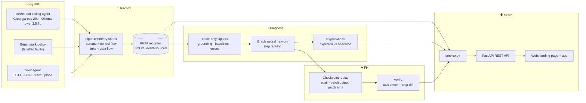
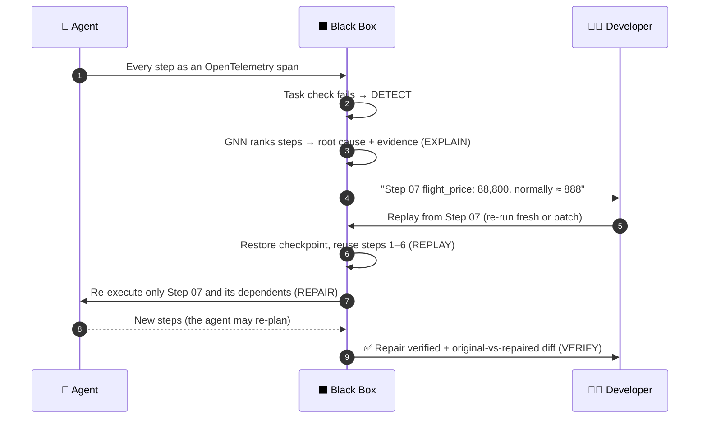

<div align="center">

# ⬛ BLACK BOX — AI Agent Flight Recorder

### From Failure to Fix — Without Starting Over.

[](https://blackbox-flight-recorder.onrender.com)
[](https://www.python.org/)
[](https://fastapi.tiangolo.com/)
[](https://opentelemetry.io/)
[](https://pytorch.org/)
[](https://groq.com/)
[](#-testing)

**🏁 Built for BNB'26 CodeStorm (GDG on Campus FCRCE) · Problem statement: _A Flight Recorder for AI Agents_**

`DETECT → EXPLAIN → REPLAY → REPAIR → VERIFY`

[**🌐 Home page**](https://blackbox-flight-recorder.onrender.com) · [**🖥️ Open the app**](https://blackbox-flight-recorder.onrender.com/app) · [**▶ Live demo**](https://blackbox-flight-recorder.onrender.com/app#/demo) · [**🔌 Connect your agent**](https://blackbox-flight-recorder.onrender.com/app#/connect) · [**📚 API docs**](https://blackbox-flight-recorder.onrender.com/docs)

</div>

---

## 🎯 Overview

AI agents are moving into production: they book travel, answer customers, process refunds and write code. When an agent gives a wrong answer, **nobody knows why**. A run can have 30 steps of model decisions and tool calls, and one bad value early on passes silently through every later step. The error only shows up at the end.

Today engineers debug this by reading logs line by line, then **re-running the entire agent** to test a fix. That's slow, and it repeats every model call.

**Black Box is a flight recorder for AI agents:**

| | |
|---|---|
| 🎥 **Records** | every model decision and tool call as an **OpenTelemetry** trace |
| 🔎 **Detects** | the failure and ranks the step that **caused** it with a **graph neural network**, not just the step where it surfaced |
| 💡 **Explains** | why, with evidence from the trace: *"flight price 88,800, normally ≈ 888"* |
| ⏪ **Replays** | from that step's **checkpoint**, reusing everything before it |
| 🛠️ **Repairs** | by re-running the step, patching its output, or patching its arguments |
| ✅ **Verifies** | the fix with the task check and a step-by-step diff of original vs repaired |

> **Monitoring tools show what happened. Black Box shows where it went wrong and why, and lets you fix and verify it without re-running everything.**

---

## ✨ Key Features

- 🧠 **Graph neural network diagnosis.** Directional message passing over the trace graph learns how errors propagate, so it finds the first bad step even when the error source moves or the agent takes a new path.
- 🤖 **A real AI agent in the live demo.** A tool-calling agent driven by **Groq `openai/gpt-oss-20b`** (hosted) or **Ollama `qwen2.5:7b`** (local) plans every step itself.
- 📡 **OpenTelemetry native.** GenAI semantic conventions (`gen_ai.operation.name`, `gen_ai.tool.name`, …): span parents give control flow, span links give data flow.
- ⏪ **Checkpointed, dependency-aware replay.** State is event-sourced, so a replay restores the checkpoint and re-executes **~34% of steps on average**. The agent may re-plan after the patch.
- 🧾 **Evidence, not guesses.** Every diagnosis comes with *expected vs observed* values, upstream health and the downstream blast radius.
- 🔌 **Bring your own agent.** Upload a JSON trace, post OTLP/HTTP JSON, or try a completely different sample agent from the browser. Each agent is judged only against **its own** history.
- 📊 **Honest metrics.** Every number in the UI is computed from recorded runs, stored diagnoses or saved replays, never invented.
- ⌨️ **Built for debugging.** ⌘K command palette, keyboard navigation (↑/↓, Enter, R), interactive timeline, trace graph, patch editor, live replay console, side-by-side verification and a latency waterfall.

---

## 🏆 Results

Measured on **5,000 dynamic-agent runs**. One labelled fault was injected per failing run, and every evaluation run was **never used for training**.

| Top-1 root-cause localization | Seen faults | Unseen fault types | Error source moved | New agent behaviour |
|---|:---:|:---:|:---:|:---:|
| **🥇 Black Box (graph neural network)** | **93.1%** | **88.4%** | 86.2% | **93.5%** |
| Gradient boosting + lineage features | 89.6% | 86.5% | **88.4%** | 88.5% |
| Rule: first suspicious step | 65.7% | 84.8% | 78.0% | 67.3% |
| Personalized PageRank (no learning) | 58.8% | 76.9% | 69.8% | 59.9% |
| Random step | 2.9% | 4.3% | 3.0% | 3.0% |

| Metric | Value |
|---|---|
| ✅ Failures fixed by repairing the **#1 suspect** | **90.9%** |
| ✅ Fixed within **3 replays** | **98.1%** |
| ⏪ Steps re-executed per replay (average) | **34%** (66% reused) |
| 🎯 Root cause in the **top 3** | 96–100% on every split |
| 📈 Run-failure detection from the trace alone | AUC 0.745 |

All numbers come from `python -m blackbox.cli all` → `data/metrics.json`, the same file the app's **Evaluation** page reads.

---

## 🏗️ Architecture



### 🔄 The debugging loop



### 🧩 Components

| Layer | Module | Responsibility |
|---|---|---|
| **Agent** | `react_agent.py` | Tool-calling loop with Groq, Ollama and scripted (benchmark) policies |
| **Tracing** | `otel.py`, `sdk.py` | OpenTelemetry spans → step graph; OTLP/HTTP JSON ingestion |
| **Recording** | `recorder.py` | Append-only SQLite log: args, outputs, timing, errors, data-flow parents |
| **Faults** | `faults_v2.py`, `generate_v2.py` | 6 training + 3 held-out fault types; labelled benchmark with drift splits |
| **Signals** | `features.py` | Trace-only features: grounding, per-tool baselines, retrieval checks, lineage |
| **Model** | `graph_model.py`, `model_v2.py` | GNN (trained in PyTorch, NumPy inference), baselines, evaluation |
| **Explain** | `model.py` | Occlusion-based evidence: which signal drives the score, expected vs observed |
| **Replay** | `replay_v2.py`, `replay.py` | Checkpoint restore, patch, dynamic re-planning, aligned diff |
| **Service** | `service.py` | The only layer the API calls; per-agent baselines for external agents |
| **API** | `api.py` | FastAPI REST endpoints + static frontend |
| **Web** | `web/` | Landing page + single-page app, plain HTML/CSS/JS, no build step |

---

## 🛠️ Tech Stack

| Area | Technology |
|---|---|
| **Backend** | Python 3.12+, FastAPI, Uvicorn |
| **AI agent** | Groq (`openai/gpt-oss-20b`), Ollama (`qwen2.5:7b`), native tool calling |
| **ML** | PyTorch (GNN training), NumPy (inference), scikit-learn (gradient boosting, run-failure model) |
| **Tracing** | OpenTelemetry SDK, GenAI semantic conventions, OTLP/HTTP JSON |
| **Storage** | SQLite (event-sourced flight recorder) |
| **Frontend** | Vanilla HTML/CSS/JS, Geist + JetBrains Mono, no framework or build step |
| **Hosting** | Render (free tier), GitHub Pages redirect |

---

## 📋 Prerequisites

- Python **3.12+**
- *(Optional)* a [Groq API key](https://console.groq.com/keys) for a real model in the live demo
- *(Optional)* [Ollama](https://ollama.com) with `qwen2.5:7b` to run the agent locally
- *(Optional)* PyTorch, only if you want to **retrain** the GNN

---

## 🚀 Installation

```bash
# 1. Clone
git clone https://github.com/Tanishqtiwari1/BNB26_CodeStorm_Internal_Round.git
cd BNB26_CodeStorm_Internal_Round

# 2. Install
python3 -m venv .venv
./.venv/bin/pip install -r requirements.txt

# 3. Build the benchmark data + diagnoses with the committed model (no PyTorch needed)
./.venv/bin/python -m blackbox.cli data

# 4. Run
./.venv/bin/uvicorn blackbox.api:app --port 8000
```

Open **http://localhost:8000** for the home page and **http://localhost:8000/app** for the app.

### 🤖 Real model for the live agent (optional)

```bash
# Local, used first when it's running
ollama serve & ollama pull qwen2.5:7b

# Hosted fallback (never commit keys)
export GROQ_API_KEY=...
```

Without either, the live agent uses the deterministic benchmark policy, and the UI labels those runs as such.

### 🧠 Retrain everything (optional)

```bash
./.venv/bin/pip install -r requirements-train.txt   # adds PyTorch
./.venv/bin/python -m blackbox.cli all              # generate 5,000 runs → train GNN + GBM → evaluate → diagnose
```

---

## ☁️ Deployment

[](https://render.com/deploy?repo=https://github.com/Tanishqtiwari1/BNB26_CodeStorm_Internal_Round)

`render.yaml` installs the requirements, rebuilds the benchmark data with the committed model (`python -m blackbox.cli data`), and starts Uvicorn. Add **`GROQ_API_KEY`** in the Render dashboard so the live demo uses a real model.

> ⏱️ Free tier: the server sleeps when idle and the first request can take 30–60 s. The database is rebuilt on each deploy, so live counters start from zero.

---

## 📊 Usage

### 1️⃣ Watch it fix a failure (60 seconds)

1. **Home page → ↻ Replay from root cause**, or **App → Live Demo → Run all**.
2. A real model plans a New York → Paris trip. An injected, labelled tool bug makes the flight API return **cents instead of dollars**, and the agent answers **$90,271, over budget**.
3. Black Box flags **Step 07 `flight_price`** at ~99% confidence: *"88,800 deviates 50σ from the baseline (typical ≈ 888)."*
4. Replay reuses 6 steps, re-runs the rest, and the agent re-plans: **$2,359.20, within budget. ✅ Repair verified.**

### 2️⃣ Connect your own agent

Upload a trace on **App → Connect Your Agent**, or post one from any language:

```bash
curl -X POST https://blackbox-flight-recorder.onrender.com/api/traces \
  -H "Content-Type: application/json" \
  -d @demo_traces/hotel_booking_bug.json
# → {"runs": ["<run id>"]}  then open /app#/investigate/<run id>
```

The simple trace format is one JSON object per run:

```json
{
  "question": "Refund order A-1042",
  "service": "my-support-bot",
  "success": false,
  "steps": [
    {"id": "t1", "name": "get_order", "kind": "tool", "output": {"total": 59.99}},
    {"id": "d1", "name": "call:issue_refund", "kind": "llm", "parents": ["t1"],
     "output": {"tool": "issue_refund", "args": {"amount": 599.9}}}
  ]
}
```

Step kinds: `input` · `llm` · `tool` · `retrieval` · `final`. `parents` lists the earlier steps whose output this step used. OpenTelemetry exporters can post **OTLP/HTTP JSON** to `/api/otlp/v1/traces`.

**Ready-made demo traces** are in [`demo_traces/`](demo_traces/):

| File | Story | Black Box finds |
|---|---|---|
| `hotel_booking_bug.json` | Booking agent books hotel **H-212** instead of **H-221** | The booking decision: "H-212 never appeared in any input" |
| `refund_bot_bug.json` | Support bot refunds **$599.90** for a **$59.99** order | The refund decision: "599.9 never appeared in any input" |

### 3️⃣ A completely different agent, from the terminal

```bash
python3 examples/my_agent.py --healthy 5                            # teach Black Box this agent's normal
python3 examples/my_agent.py --strategy running_total --bug cents   # then break it
```

A grocery-budget agent with 3 strategies (different trace graphs) and 3 bugs, sending real OpenTelemetry spans.

### 🔗 API

| Method | Endpoint | Purpose |
|---|---|---|
| `GET` | `/api/info` · `/api/stats` · `/api/metrics` | Model, live agent, counters, evaluation |
| `GET` | `/api/runs` · `/api/runs/{id}` · `/api/runs/{id}/trace` | Recorded runs and traces |
| `GET` | `/api/runs/{id}/diagnosis` · `/api/runs/{id}/steps/{sid}/explanation` | Root cause, evidence, impact |
| `POST` | `/api/runs/{id}/replay` `{sid, mode, patch}` | Replay from a checkpoint (`repair` · `patch_output` · `patch_args`) |
| `GET` | `/api/compare?a=&b=` · `/api/replays` · `/api/runs/{id}/forks` | Original vs repaired |
| `POST` | `/api/demo/killer` · `/api/agent/run` | Run the live agent |
| `POST` | `/api/traces` · `/api/otlp/v1/traces` | Ingest traces from any agent |
| `GET`/`POST` | `/api/connect/options` · `/api/connect/sample` | In-browser sample agent |

Interactive docs: **[/docs](https://blackbox-flight-recorder.onrender.com/docs)**

---

## 🔧 Configuration

| Variable | Description | Default |
|---|---|---|
| `GROQ_API_KEY` | Groq key for the hosted live agent | *(unset → Ollama or benchmark policy)* |
| `GROQ_MODEL` | Groq model to use | auto-picks `openai/gpt-oss-20b` when available |
| `GROQ_REASONING` | Reasoning effort for Groq models | `medium` |
| `BLACKBOX_SLM` | Ollama model for the local agent | `qwen2.5:7b` |
| `OLLAMA_HOST` | Ollama server URL | `http://localhost:11434` |
| `BLACKBOX_DEMO_POLICY` | `slm` = real model in the demo when reachable | `slm` |
| `BLACKBOX_DB` | Flight-recorder database | `data/blackbox.db` |
| `BLACKBOX_MODEL` | Diagnosis model bundle | `data/model_v2.joblib` |
| `BLACKBOX_METRICS` | Evaluation metrics file | `data/metrics.json` |
| `BLACKBOX_BACKGROUND` | Diagnose stored failures in the background at startup | `1` |

---

## 🧪 Testing

```bash
./.venv/bin/python -m pytest -q     # 29 tests: v1 + v2 end to end
```

The tests cover:
- the dynamic agent and its OpenTelemetry spans;
- fault injection;
- **no label leakage** (diagnosis is identical with labels deleted);
- GNN training and evaluation;
- dynamic replay;
- expression grounding;
- trace upload;
- the bring-your-own-agent flow.

---

## ⚖️ Honest scope

- **Synthetic benchmark.** Training and evaluation use one travel-expense workflow with injected faults. On a completely different agent, the true cause was ranked first in **9 of 18** failures; accuracy improves as Black Box builds that agent's own history.
- **Missing steps are hard.** If an agent skips a step entirely, nothing anomalous is recorded at the cause.
- **Replay needs an adapter.** The built-in agent is fully replayable; uploaded and OTLP traces are diagnosis-only.

---

## 🗺️ Roadmap

- [x] Record (OpenTelemetry) → diagnose (GNN) → explain → replay → verify
- [x] Real model in the live demo · bring-your-own-agent traces
- [ ] **Replay any agent:** Black Box calls your agent back to re-run a step
- [ ] **One-line setup:** pip package + binary OTLP, so LangChain and OpenAI Agents SDK connect with no changes
- [ ] **Alerts:** Slack or email on failure, with the root cause attached
- [ ] **Accounts & storage:** projects, API keys, permanent traces
- [ ] **Learns from your fixes:** every verified repair becomes training data

---

## 📁 Project Structure

```
├── blackbox/
│   ├── react_agent.py    # tool-calling agent: Groq, Ollama, scripted policies
│   ├── otel.py           # OpenTelemetry spans → step graph, OTLP ingestion
│   ├── recorder.py       # flight recorder (SQLite)
│   ├── faults_v2.py      # decision + tool faults (6 training, 3 held-out)
│   ├── generate_v2.py    # labelled benchmark with drift splits
│   ├── features.py       # trace-only signals and per-agent baselines
│   ├── graph_model.py    # GNN + PageRank baseline
│   ├── model_v2.py       # training, evaluation, diagnosis
│   ├── model.py          # analysis + evidence (explanations)
│   ├── replay_v2.py      # dynamic checkpoint replay
│   ├── replay.py         # diff / compare
│   ├── demo.py           # live demo scenario
│   ├── service.py        # application service
│   ├── api.py            # FastAPI endpoints + static web
│   └── cli.py            # data / train / eval commands
├── web/                  # landing page + app (HTML/CSS/JS)
├── examples/my_agent.py  # bring-your-own-agent example
├── demo_traces/          # ready-made traces for the upload panel
├── data/                 # committed model + metrics
├── tests/                # 29 end-to-end tests
└── render.yaml           # one-click deploy
```

---

## 🙏 Acknowledgments

- **GDG on Campus FCRCE** for organizing BNB'26 CodeStorm and the problem statement
- **Our mentor**, whose feedback (real models, OpenTelemetry, a graph-based approach) shaped v2
- **Groq** and **Ollama** for fast model inference
- **OpenTelemetry** for the open tracing standard

---

<div align="center">

**Built with ❤️ by [@Tanishqtiwari1](https://github.com/Tanishqtiwari1)**

*Stop restarting failed agents. Find the step. Replay from the checkpoint.* ⬛

</div>
